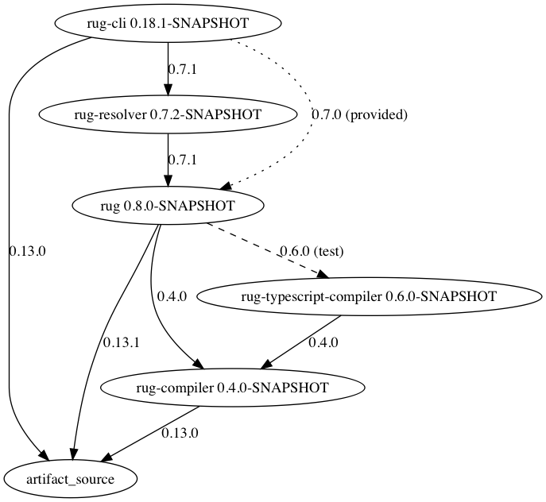

# jess makes a picture
 
I used this make a graph of maven dependencies between the repos in one org.

See? check this out:

that's from 28/12/16

This program starts with one project name (with the org hard-coded),
 clones its repo, then checks its pom for intra-org dependencies.
 For each intra-org dep it clones that repo too, then checks its pom.
 
I supposed I could have curled github rather than cloning. oh well, I have what I want
for the moment.

If you wanted to use this, you would:

- import this project into IntelliJ
- modify FetchAllApp.scala to change the hard-coded org name and output name
- if you don't want repos cloned into your project dir: set up a run configuration that runs it where you want the repos cloned
- right-click in MakeAPicture to run it in IntelliJ

Nope, this isn't useful enough yet for me to set up an executable jar and a script.
